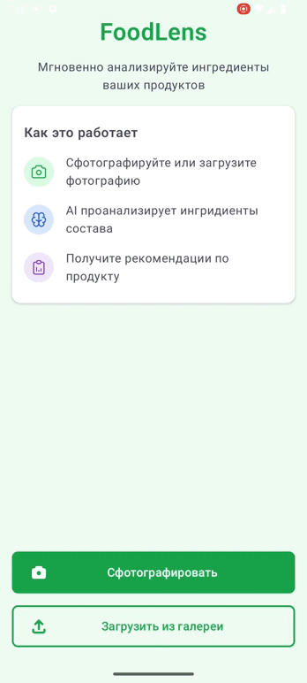
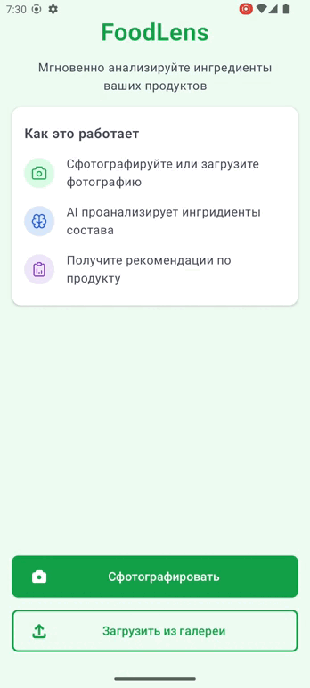

# FoodLens

**FoodLens** – интеллектуальное Android-приложение для анализа состава продуктов с помощью OCR.
Приложение распознаёт текст на изображении, анализирует ингредиенты, определяет степень их вредности и выдает рекомендации.

---

## Возможности

- Сделать снимок или выбрать фотографию из галереи
- Отображение камеры в реальном времени (CameraX)
- Предобработка изображения (OpenCV)
- Обрезка фотографии (UCrop)
- Распознавание текста (Tesseract OCR)
- Выделение вредных ингредиентов и пояснение их воздействия
- Современный UI на Jetpack Compose

---

## Демонстрация

| Вредный состав                         | Умеренный состав                             | Полезный состав                            | На фотографии нет текста     |
|----------------------------------------|----------------------------------------------|--------------------------------------------|------------------------------|
|  |  |  |  |

---

## Установка

### Установка APK-файла

Скачайте `.apk` из папки `release` (если доступно) и установите вручную на устройство Android.

### Вариант 2: Сборка из исходников

1. Склонируйте репозиторий.

2. Откройте проект в Android Studio.

3. Запустите проект на устройстве или эмуляторе (API 33+).

---

## Требования

- Android 13 (API 33) или выше
- Камера (опционально, но желательно)
- Разрешения: `CAMERA`

---

## Технологии и библиотеки

| Компонент                | Версия         | Назначение                                                        |
|--------------------------|----------------|-------------------------------------------------------------------|
| **Kotlin**               | 2.1.10         | Язык программирования                                             |
| **Jetpack Compose**      | BOM 2025.06.01 | Современный UI-фреймворк от Google                                |
| **Hilt**                 | 2.56.2         | Внедрение зависимостей (Dependency Injection)                     |
| **CameraX**              | 1.4.2          | Работа с камерой (предпросмотр, захват фото)                      |
| **OpenCV**               | 4.5.2          | Предобработка изображений (фильтрация, улучшение контраста и др.) |
| **Tesseract (tess-two)** | 9.1.0          | Распознавание текста (OCR)                                        |
| **UCrop**                | 2.2.8          | Кадрирование и редактирование изображений                         |
| **Coil (Compose)**       | 2.5.0          | Загрузка изображений в Jetpack Compose                            |
| **Navigation Compose**   | 2.9.1          | Навигация между экранами в Compose                                |
| **Coroutines**           | 1.7.3          | Асинхронное и параллельное выполнение кода                        |
| **GSON**                 | 2.13.1         | Работа с JSON (сериализация и десериализация)                     |
| **Espresso**             | 3.6.1          | UI-тестирование                                                   |
| **JUnit**                | 4.13.2         | Юнит-тестирование                                                 |

---

## Вклад

Pull Request'ы и Issues приветствуются!

1. Форкните репозиторий
2. Создайте новую ветку: `feature/YourFeature`
3. Внесите изменения и закоммитьте
4. Откройте Pull Request

---

## Лицензия

Проект защищён авторским правом.  
**Код и ресурсы предназначены только для личного и образовательного использования.**  
**Коммерческое использование, распространение или встраивание без согласия автора запрещено.**

> © 2025 Игорь Васюнин. Все права защищены.

---

## Контакты

- Автор: **Игорь Васюнин**
- Почта: [i11usiongid@gmail.com](mailto:i11usiongid@gmail.com)
- Telegram: [@i11usionGid](https://t.me/i11usionGid)